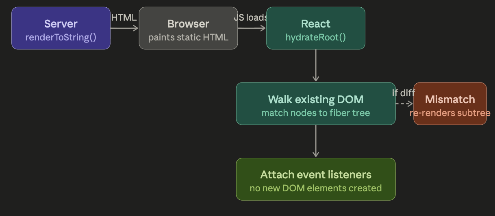
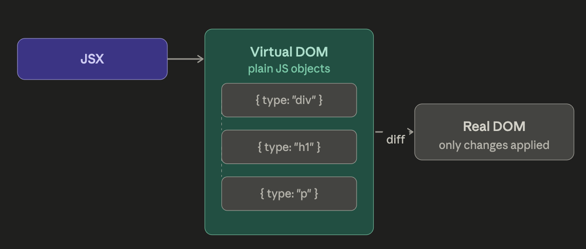

# React Architecture

## Hydration

### https://github.com/reactwg/react-18/discussions/37
### https://www.reddit.com/r/reactjs/comments/18fky3q/what_is_hydration_in_react/
Hydration is the process when, after the HTML be pre-rendered, we add interactivity with JS.

## Virtual Dom

VDOM is the react representation in memory of DOM, to minimize reflows and repaints,
when state or props changes, react creates a new VDOM to compare with the previous one(process called reconciliation).
-> Minimizes real DOM mutation(expensive work)
-> Uses [reconciliation](#reconciliation) to update only what changed
-> [React fiber](#react-fiber)

What let's it slow:
-> Unnecessary re-renders
-> Bad keys in lists
-> Breaks memoization
-> Lists without virtualization

### React Fiber
Instead of rendering all DOM updates together. React breaks it in small chunks, can be paused, resumed or prioritized.

## Reconciliation
Identifier the minimum of changes to update the real DOM.
Previous VDOM vs new VDOM

## Reconciliation (process inside virtual dom)

## What other frameworks do/use?

### Vue 
Uses VDOM, similar idea to react
### Angular
Uses real DOM directly
### Svelte
Convert components into imperative DOM operations at build time

## Examples in react codebase

- Hydration API: [hydrateRoot docs](https://react.dev/reference/react-dom/client/hydrateRoot)
- Client root setup: [ReactDOMRoot.js](https://github.com/facebook/react/blob/main/packages/react-dom/src/client/ReactDOMRoot.js)
- Fiber data structure: [ReactFiber.js](https://github.com/facebook/react/blob/main/packages/react-reconciler/src/ReactFiber.js)
- Work loop and scheduling: [ReactFiberWorkLoop.js](https://github.com/facebook/react/blob/main/packages/react-reconciler/src/ReactFiberWorkLoop.js)
- Reconciliation and child diffing: [ReactFiberBeginWork.js](https://github.com/facebook/react/blob/main/packages/react-reconciler/src/ReactFiberBeginWork.js) and [ReactChildFiber.js](https://github.com/facebook/react/blob/main/packages/react-reconciler/src/ReactChildFiber.js)
- Hooks and effects: [ReactFiberHooks.js](https://github.com/facebook/react/blob/main/packages/react-reconciler/src/ReactFiberHooks.js)

- `ReactDOMRoot.js` is where `createRoot` and `hydrateRoot` enter the system.
- `ReactFiberWorkLoop.js` is how updates are scheduled and processed.
- `ReactFiberBeginWork.js` and `ReactChildFiber.js` when you want to understand reconciliation and list diffs.
- `ReactFiber.js` when you want the actual Fiber node shape and fields.
- `ReactFiberHooks.js` when you want to connect `useState`, `useEffect`, and other hooks to the reconciler.

